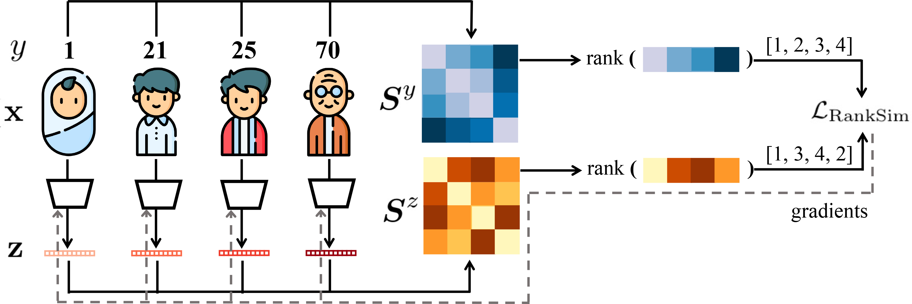

# RankSim: Ranking Similarity Regularization for Deep Imbalanced Regression
This repository contains the code for the paper: <br>
__RankSim: Ranking Similarity Regularization for Deep Imbalanced Regression__ <br> 
Yu Gong, Greg Mori, Fred Tung <br>
ICML 2022 <br>
[[arXiv](https://arxiv.org/abs/2205.15236)] [[Paper](https://proceedings.mlr.press/v162/gong22a.html)] [[Poster](figures/poster_ranksim.jpg)]<br>
<p align="center">
     <br>
<b>RankSim </b> (ranking similarity) regularizer encodes an inductive bias that samples that are closer in label space should also be closer in feature space.
</p>

## Quick Preview
<b>RankSim </b> regularizer is straightforward to implement, can be computed in closed form, and complementary to conventional imbalanced learning techniques. It has two hyperparameters --- *interpolation strength* lambda and *balancing weight* gamma.

```python
def batchwise_ranking_regularizer(features, targets, interp_strength_lambda):
    loss = 0

    # Reduce ties and boost relative representation of infrequent labels by computing the 
    # regularizer over a subset of the batch in which each label appears at most once
    batch_unique_targets = torch.unique(targets)
    if len(batch_unique_targets) < len(targets):
        sampled_indices = []
        for target in batch_unique_targets:
            sampled_indices.append(random.choice((targets == target).nonzero()[:,0]).item())
        x = features[sampled_indices]
        y = targets[sampled_indices]
    else:
        x = features
        y = targets

    # Compute feature similarities for ranking
    xxt = torch.matmul(F.normalize(x.view(x.size(0),-1)), F.normalize(x.view(x.size(0),-1)).permute(1,0))

    # Compute the loss of ranking similarity
    for i in range(len(y)):

        label_ranks = rank_normalised(-torch.abs(y[i] - y).transpose(0,1))
        feature_ranks = TrueRanker.apply(xxt[i].unsqueeze(dim=0), interp_strength_lambda) # differentiable ranking operation, defined in ranking.py
        loss += F.mse_loss(feature_ranks, label_ranks)

    return loss
```

## Usage

Please go into the sub-folder to run experiments for different datasets. 

- [IMDB-WIKI-DIR](./imdb-wiki-dir)
- [AgeDB-DIR](./agedb-dir)
- [STS-B-DIR](./sts-b-dir)

## Citation
If you find RankSim helpful, please cite our work:
```bib
@InProceedings{gong2022ranksim,
  title={{R}ank{S}im: Ranking Similarity Regularization for Deep Imbalanced Regression},
  author={Gong, Yu and Mori, Greg and Tung, Frederick},
  booktitle={International Conference on Machine Learning (ICML)},
  year={2022}

```

## Acknowledgment

The code is based on [Yang et al., Delving into Deep Imbalanced Regression, ICML 2021](https://github.com/YyzHarry/imbalanced-regression/tree/main/imdb-wiki-dir). 